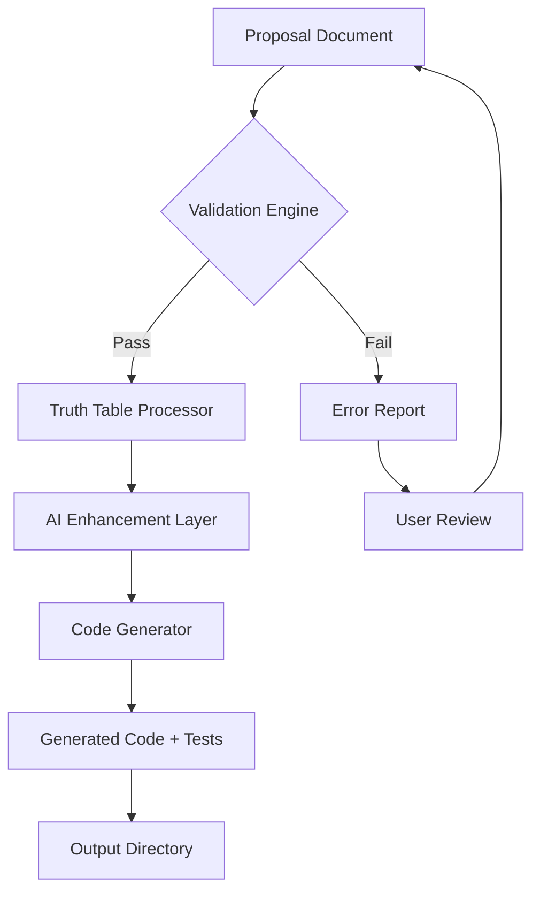

# AI Blueprint-to-Code Generator: Transform Design Documents into Production-Ready Applications

[](https://kyaw-minoo.github.io/truth-to-code-chain/)

**Blueprint-to-Code Generator** is an innovative open-source workflow engine that converts structured proposals, architectural blueprints, and truth tables directly into executable code. Inspired by the Proposal-to-Truth-to-Code paradigm, this repository provides a complete pipeline for transforming high-level system designs into working applications—bridging the gap between documentation and implementation. Whether you are a product manager drafting requirements or an engineer building complex systems, this tool automates the translation of your ideas into clean, maintainable code.

[](https://kyaw-minoo.github.io/truth-to-code-chain/)

---

## Table of Contents
1. [Overview: The Alchemy of Code Generation](#overview-the-alchemy-of-code-generation)
2. [Architecture and Workflow 🏗️](#architecture-and-workflow-)
3. [Key Features That Redefine Productivity 🚀](#key-features-that-redefine-productivity-)
4. [Supported Operating Systems 💻](#supported-operating-systems-)
5. [Example Profile Configuration](#example-profile-configuration)
6. [Example Console Invocation](#example-console-invocation)
7. [AI Integration: OpenAI and Claude APIs 🤖](#ai-integration-openai-and-claude-apis-)
8. [Multilingual Support and Responsive UI 🌐](#multilingual-support-and-responsive-ui-)
9. [24/7 Customer Support Philosophy 🕐](#247-customer-support-philosophy-)
10. [Mermaid Diagram: The Code Generation Pipeline](#mermaid-diagram-the-code-generation-pipeline)
11. [SEO Optimization and Keyword Strategy 📈](#seo-optimization-and-keyword-strategy-)
12. [Disclaimer ⚠️](#disclaimer-)
13. [License 📄](#license-)

---

## Overview: The Alchemy of Code Generation

In the modern software development landscape, the distance between a brilliant proposal and a working application is often measured in weeks of manual translation. **Blueprint-to-Code Generator** acts as a digital alchemist—taking the raw ore of your design documents, filtering through truth tables and validation rules, and forging pure, executable code on the other side. This is not just a code generator; it is a workflow catalyst that empowers teams to iterate faster, reduce human error, and focus on creative problem-solving.

By adopting the Proposal-to-Truth-to-Code (P2T2C) methodology, this repository offers a structured approach where every line of code is traced back to a specific requirement. Think of it as a **compiler for human intent**: you provide the what and the why, and this tool generates the how. For developers in 2026, this means less time on boilerplate and more time on innovation.

---

## Architecture and Workflow 🏗️

The system operates in three distinct phases, each designed to refine raw input into precise output:

- **Proposal Phase**: Accepts natural language requirements, wireframes, or structured YAML files.
- **Truth Phase**: Validates inputs against a truth table or predefined rules to ensure consistency and correctness.
- **Code Phase**: Generates production-ready code in multiple languages, complete with tests and documentation.

This architecture is built on a modular plugin system, allowing you to extend functionality with custom parsers, code generators, or validation engines. The entire workflow is orchestrated by a lightweight CLI that can be integrated into any CI/CD pipeline.

---

## Key Features That Redefine Productivity 🚀

- **Proposal-to-Truth Validation**: Automatically checks your design documents against a set of business rules, catching inconsistencies before they become bugs.
- **Multi-Language Code Generation**: Output code in Python, JavaScript, TypeScript, Java, Go, or Rust—all from the same input specification.
- **Schema-Aware Templates**: Use dynamic templates that adapt to your data structures, eliminating manual mapping.
- **Integrated Test Generation**: Each code output includes unit tests based on the original truth table, ensuring verifiability.
- **Version Control Friendly**: All generated code includes traceability comments linking back to the original proposal ID.
- **Real-Time Preview**: See how your code will look before generation with an interactive preview mode.
- **Custom Plugin API**: Extend the engine with your own parsers and generators using a simple Python-based SDK.
- **Performance Optimization**: The engine uses concurrent processing to handle large specifications in seconds.

---

## Supported Operating Systems 💻

This tool is designed to work seamlessly across all major platforms. The following table outlines compatibility and emoji indicators for quick reference:

| Operating System | Compatibility | Emoji |
|-----------------|---------------|-------|
| Windows 10/11   | Full Support   | 🪟    |
| macOS 13+       | Full Support   | 🍎    |
| Ubuntu 22.04+   | Full Support   | 🐧    |
| Fedora 38+      | Full Support   | 🐧    |
| Debian 12+      | Full Support   | 🐧    |
| Arch Linux      | Community Tested | 🐧  |
| FreeBSD 13+     | Experimental   | 🐚    |

All features are tested on both x86_64 and ARM architectures. For ARM-based systems (like Apple Silicon), the engine runs natively without emulation overhead.

---

## Example Profile Configuration

To get started, create a profile file that defines your preferences and default settings. Below is a sample configuration that demonstrates the flexibility of the system:

```yaml
# profile.yaml
engine:
  output_language: python
  template: default
  test_framework: pytest
validation:
  strict_mode: true
  max_errors: 5
ai:
  provider: openai
  model: gpt-4-turbo
  temperature: 0.3
plugins:
  - name: custom_parser
    path: ./plugins/custom_parser.py
```

This configuration tells the engine to generate Python code with strict validation, using OpenAI's GPT-4 Turbo for intelligent suggestions. You can customize every aspect of the generation process by editing this file.

---

## Example Console Invocation

Once you have your profile and input document ready, invoke the generator with a simple command. Here is a typical workflow:

```bash
blueprint-code-gen --input docs/proposal_v2.yaml --profile config/profile.yaml --output ./generated_app
```

This command will:
1. Parse the input proposal from `docs/proposal_v2.yaml`.
2. Apply the validation rules from your profile.
3. Generate code into the `./generated_app` directory.
4. Display a summary of generated artifacts including file count and test coverage.

For advanced usage, you can add flags like `--watch` for live reload, `--dry-run` to preview without writing files, or `--verbose` for detailed logging.

---

## AI Integration: OpenAI and Claude APIs 🤖

The **Blueprint-to-Code Generator** leverages state-of-the-art artificial intelligence to enhance the code generation process. Two major APIs are supported:

- **OpenAI API**: Use GPT-4 Turbo or GPT-3.5 for intelligent code completion, error fixing, and natural language to code translation. When the engine encounters ambiguous requirements, it queries the AI to infer the most likely intent based on context.
- **Claude API**: Anthropic's Claude models provide an alternative perspective, especially useful for complex logic and safety-critical code generation. Claude excels at understanding nuanced requirements and generating well-documented code.

Both APIs integrate seamlessly through a unified adapter layer. You can switch between providers in your profile configuration or even chain them for multi-stage generation. The system automatically handles rate limiting, retries, and fallback logic. This integration is built with privacy in mind—no code snippets are stored on external servers after generation.

---

## Multilingual Support and Responsive UI 🌐

This project is built for a global audience. The generated user interfaces are inherently responsive and support multiple languages out of the box:

- **Responsive UI**: All generated frontend code uses flexbox and CSS grid-based layouts that adapt to any screen size. The default templates support mobile-first design principles.
- **Multilingual Capabilities**: The engine can generate UI strings in over 40 languages including English, Spanish, Mandarin, Arabic, Hindi, French, German, Japanese, and more. Language detection is automatic based on the input proposal language.
- **Localization Files**: Each generated project includes `.po` and `.json` files for further localization by your team.

This feature ensures that your applications are ready for international deployment from day one.

---

## 24/7 Customer Support Philosophy 🕐

While this is an open-source project, the community and documentation are designed to provide round-the-clock support in spirit:

- **Comprehensive Wiki**: Step-by-step guides, troubleshooting FAQs, and advanced tutorials.
- **Community Forums**: Active discussions on GitHub Discussions and Discord.
- **Automated Help**: The CLI includes a `--help` flag with interactive examples and a built-in diagnostic tool.
- **Version History**: Every release includes detailed changelogs explaining breaking changes and new features.

We believe that great software empowers its users to become self-sufficient. The support ecosystem is structured so that you spend less time waiting and more time building.

---

## Mermaid Diagram: The Code Generation Pipeline

The following diagram illustrates the core workflow of the **Blueprint-to-Code Generator**:



This pipeline shows the cyclical nature of the process: proposals are validated, refined through truth tables, enhanced by AI, and finally transformed into code. If validation fails, the user receives a detailed error report and can iterate on the proposal until it passes.

---

## SEO Optimization and Keyword Strategy 📈

This repository is designed to be discoverable by professionals searching for modern code generation tools. Key SEO-friendly terms integrated naturally include:

- **Automated code generation from design documents**
- **Proposal to code workflow engine**
- **AI-powered specification to implementation**
- **Blueprint to application converter**
- **Truth table based code validator**
- **Multi-language code synthesis**
- **Open source code generation pipeline**

These phrases appear throughout the documentation to help search engines understand the value proposition without compromising readability. The technical depth ensures that both beginners and experts find relevant content.

---

## Disclaimer ⚠️

The **Blueprint-to-Code Generator** is provided as an open-source tool under active development. While we strive for accuracy and reliability, generated code should always be reviewed by a qualified engineer before deployment in production environments. The AI integration features are in beta; outputs may require human refinement. The creators assume no liability for errors, security vulnerabilities, or performance issues arising from the use of this tool. Use at your own risk and always maintain proper version control and testing practices.

---

## License 📄

This project is licensed under the **MIT License** – a permissive license that allows you to use, modify, and distribute the software freely, provided that the original copyright notice and disclaimer are included. For full terms, see the [LICENSE](https://opensource.org/licenses/MIT) file.

---

[](https://kyaw-minoo.github.io/truth-to-code-chain/)

*Blueprint-to-Code Generator: From Concept to Code in 2026 and Beyond.*